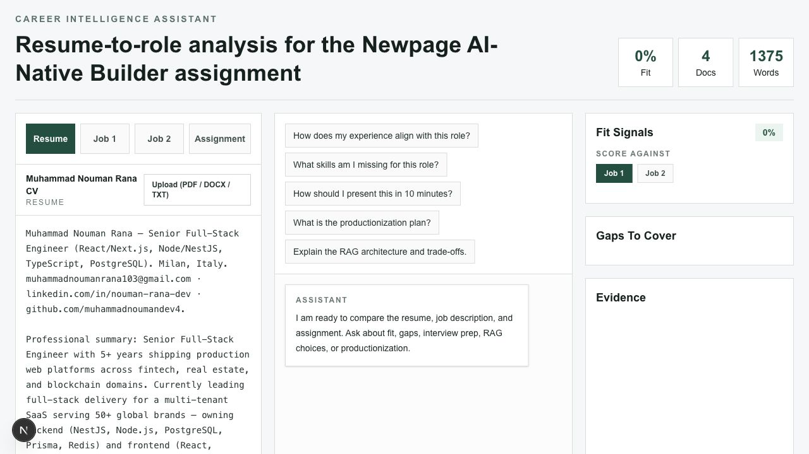
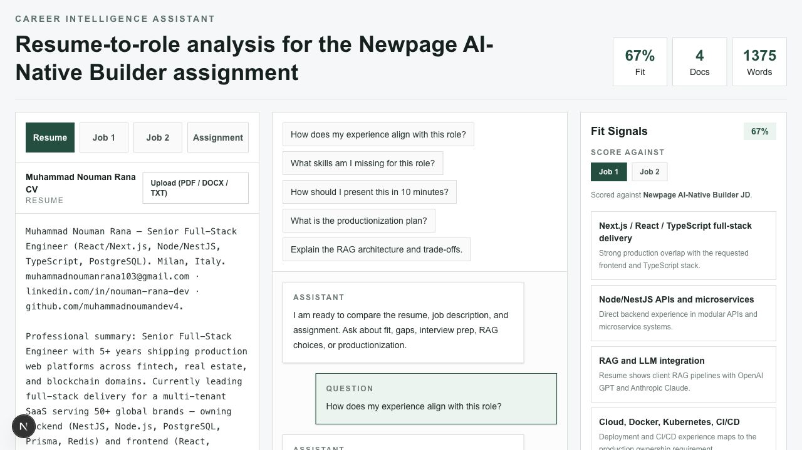
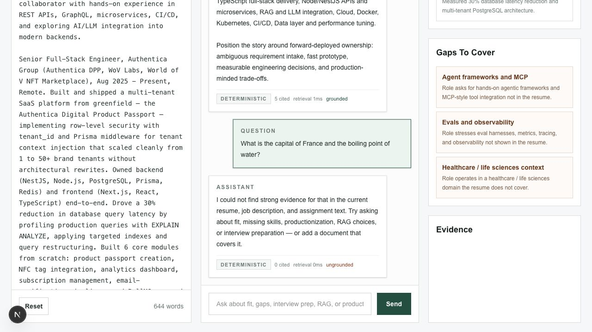

# Career Intelligence Assistant

A conversational RAG app that reads a resume and one or more job descriptions, then answers questions about role fit, skill gaps, shortlist chances, interview prep, the RAG architecture itself, and how I'd ship it to production. Documents can be pasted/edited inline or uploaded as **PDF / DOCX / TXT** (parsed server-side, still keyless). You can **add as many job postings as you want** (and remove them) right in the UI — fit is scored per job, so pick a posting and the same resume scores differently against each one.

I picked **Option 4 (Career Intelligence Assistant)** because it lets me use real inputs as the corpus — my CV and the Newpage AI-Native Builder JD — so the demo is grounded in real data instead of a toy dataset.

The one decision that shaped everything else: **it has to run with zero API keys.** I don't have paid API access, and I didn't want a live demo that dies because a key is missing or rate-limited. So the default path is fully deterministic and offline. The LLM path is real and wired up, but it's gated behind env keys — if they're present the app upgrades itself to embeddings + an LLM (Anthropic Claude, OpenAI GPT, or Google Gemini, whichever key is set); if not, it degrades gracefully to lexical retrieval and templated grounded answers. Same contract, same guardrails, same UI either way.

## Quick start

```bash
npm install
npm run dev
```

Open [http://localhost:3000](http://localhost:3000). No `.env` needed — it boots in deterministic mode.

Full check suite (what CI runs):

```bash
npm run lint        # eslint
npm run typecheck   # tsc --noEmit
npm test            # vitest (unit tests for chunking, retrieval, fit, guardrails)
npm run eval        # RAG eval gate — fails the build if retrieval/refusal/grounding regress
npm run build       # next build (standalone output)
```

Docker:

```bash
docker build -t career-assistant .
docker run -p 3000:3000 career-assistant
```

## Screenshots

| Overview | Fit analysis |
|---|---|
|  |  |

| Refusal guardrail | Trace row |
|---|---|
|  |  |

## How it works

```mermaid
flowchart LR
  A[Resume / Job descriptions<br/>editable in the UI] --> B[POST /api/chat<br/>Zod-validated]
  B --> C[Paragraph-aware chunker]
  C --> D{mode}
  D -->|deterministic| E[TF-IDF lexical retrieval]
  D -->|llm| F[Hybrid: TF-IDF + embeddings<br/>fused with RRF]
  E --> G[Guardrails:<br/>enough context? grounded?]
  F --> G
  G -->|insufficient| R[Refuse + say why]
  G -->|ok, deterministic| T[Templated grounded answer]
  G -->|ok, llm| L[LLM (Claude/Gemini),<br/>context-only prompt]
  T --> H[Answer + citations + fit signals + trace]
  L --> H
  R --> H
```

Everything retrieval-related lives in `src/lib/rag/`, deliberately split so each piece is independently testable and swappable:

| File | Responsibility |
|------|----------------|
| `chunk.ts` | Paragraph-aware chunking (~850 char cap) + tokenizer with stop-word filtering |
| `retrieval.ts` | TF-IDF lexical scoring, cosine similarity, Reciprocal Rank Fusion (k=60) |
| `providers.ts` | LLM-mode adapters — OpenAI embeddings, Claude/Gemini generation (only touched when keys exist) |
| `fit.ts` | JD-driven fit: a skill taxonomy where the *selected job* decides which skills count, then the resume is scored on coverage — so fit is relative to the role, not hard-coded |
| `guardrails.ts` | Relevance threshold, grounding check, refusal message |
| `engine.ts` | Orchestration — picks mode, runs retrieval, applies guardrails, composes the answer |

## RAG decisions and trade-offs

**Chunking.** Paragraph-aware, capped around 850 characters. Resumes and JDs are already paragraph/bullet structured, so respecting those boundaries keeps a skill and its context in the same chunk instead of splitting mid-sentence on a fixed token window. I tokenize with a stop-word list that includes interrogatives (what/how/why/…) so question words don't accidentally match noise in the corpus.

**Retrieval.** Two modes behind one interface:
- *Deterministic (default):* TF-IDF lexical retrieval. Repeatable, explainable, and it makes the demo behave identically every time — which matters when I'm presenting live.
- *LLM mode (keys present):* dense embeddings combined with the lexical scores via **Reciprocal Rank Fusion**, then grounded generation with an LLM. Both generation and embeddings are **provider-agnostic and resolved independently**, so a user can bring *any* vendor — and even mix them in a single request. Generation supports **Anthropic (Claude), OpenAI (GPT), or Google (Gemini)**; embeddings support **OpenAI (`text-embedding-3-small`) or Google (`gemini-embedding-001`)**. One vendor's key is enough for full hybrid retrieval; with two keys you can run, say, Claude generation + OpenAI embeddings together. Hybrid beats either signal alone — lexical nails exact terms like "NestJS", vectors catch paraphrase like "containerized deployments" ≈ "Docker".

**Why these picks.** `text-embedding-3-small` is cheap and good enough for this corpus size; I'd only reach for a larger model if recall measurably suffered. For synthesis the generation model is pluggable — Claude, GPT, or Gemini — selected by which key is present, because the answers here are reasoning-over-evidence, not raw generation, so the specific model matters less than the grounding around it. Vectors are held in memory because the corpus is a handful of small documents — standing up pgvector for that would be over-engineering. The interface is built so swapping in a real vector store is a `providers.ts` change, not a rewrite.

**Intent handling, and how "general" each mode really is.** This is the most important honesty point, so I'll be precise about it. The genuinely general parts of the system work for *any* question with no per-question code: retrieval (TF-IDF / hybrid) finds relevant evidence, the grounding gate decides whether there's enough to answer, and fit-scoring derives strengths/gaps from whatever resume+JD you provide. None of that is hard-coded to specific phrasings.

The one place the two modes differ is deciding *what kind* of career question was asked (overall fit vs. skill gaps vs. interview prep vs. shortlist odds), so the answer can be shaped appropriately:
- *LLM mode* does this **semantically** — the retrieval query can still be expanded with the same domain intent signals, but the final answer is not a keyword template. The model reads the actual question plus the retrieved context and responds from evidence. Out-of-scope questions are declined because the system prompt forbids answering outside the provided documents. This is the more general path for arbitrary phrasing.
- *Deterministic mode* has no model, so it uses **rule-based intent classification** plus a general self-referential-and-career fallback. I'm candid about the trade-off: rules can't *understand* language, so a sufficiently unusual phrasing can be mis-routed or fall through to an honest refusal rather than a wrong answer. That's a deliberate safety bias — in a keyless system I'd rather say "I don't have a grounded answer" than fabricate one. Closing that gap fully requires semantic understanding, which is precisely what the embeddings/LLM path adds. So the architecture is: **general retrieval + grounding + fit-scoring in both modes; semantic intent understanding when a key is present, rule-based intent routing when it isn't.**

**Orchestration framework.** None on purpose. This is a single-step *retrieve → guard → answer* flow, so plain TypeScript in `engine.ts` is clearer and easier to debug than a graph framework. I considered LangGraph but it earns its keep only once you have multi-step agent state, branching, or tool loops — none of which this needs yet. The engine is structured as discrete stages, so dropping in LangGraph later is a refactor of one file, not the app.

**Fit scoring (multi-JD).** Fit is a transparent skill taxonomy, not a black box. Each skill carries the terms that mean *a job requires it* and the terms that mean *the resume covers it*. When you pick a job, only the skills that job actually asks for count toward the denominator — so the same resume scores **67% against the Newpage AI-Native Builder JD** (gaps: agent frameworks/MCP, eval harnesses, healthcare domain) and **80% against a conventional fintech full-stack JD** (one gap: observability). That contrast is the point: the score is relative to the role, and I can explain every line of it. Earlier I had a bug where the term `eval` matched as a substring inside `retrieval`, inflating the score; I fixed it with whole-term boundary matching, which is why the honest number is 67% and not higher.

**Prompt & context management.** The LLM prompt is a fixed system instruction that forbids outside knowledge and requires `[title]` citations; context is only the top retrieved chunks (capped so I stay well inside the model window), ordered by fused score. Temperature is low for repeatability. In deterministic mode the same retrieved context drives intent-keyed answer templates instead of a model.

**Guardrails.** Before any answer, the engine checks whether retrieval cleared a relevance threshold. If nothing relevant comes back, it refuses and says why instead of hallucinating. Every non-refusal answer must carry at least one citation, and `grounded` is only true when both conditions hold. The LLM prompt is context-only with `[title]` citation enforcement and low temperature; on any LLM error the request degrades to the deterministic path rather than failing the user. The `/api/chat` boundary also bounds input — at most 12 documents, 50k chars each, 200k chars total — so an oversized paste can't blow up retrieval latency or per-chunk embedding cost. Every external provider call carries a 30s timeout so a hung provider surfaces as a catchable error and falls back to deterministic mode.

**Observability.** Every request returns a trace (mode, chunks cited, retrieval ms, answer ms, token counts, grounded flag) that the UI renders under each answer, and the server emits the same as structured JSON logs. So during the demo you can see *why* an answer came out the way it did.

**Evals as a gate.** `npm run eval` runs a golden set of 8 cases through the engine and scores retrieval hit rate, refusal accuracy (adversarial off-topic questions *must* be refused), and grounded rate. Thresholds are enforced — the script exits non-zero, so CI fails on a RAG regression the same way it fails on a broken type. This is the part I'd want a reviewer to look at: the quality bar is executable, not a paragraph of prose.

## Productionizing this

What I'd add, roughly in order of value:

1. **Robust ingestion** — PDF/DOCX upload + text extraction already works (`/api/extract`, via `unpdf` and `mammoth`, fully keyless). What's left for production is the durable side: upload to object storage, OCR for scanned/image-only PDFs, and chunk + embed in a background job with retries instead of synchronously.
2. **Persistence** — Postgres for document/chunk metadata, pgvector (or a managed vector DB once scale justifies the ops cost) for embeddings. Per-user document collections.
3. **Auth + tenancy** — ownership, row-level isolation, encrypted storage, deletion workflows, PII handling. I've built multi-tenant row isolation before; this is the same shape.
4. **Streaming answers** — stream the LLM response from the route handler instead of awaiting the full completion.
5. **Reranking** — add a cross-encoder rerank step on top of hybrid retrieval for high-value queries.
6. **Ops** — the structured logs and eval gate are already here; I'd wire them to OpenTelemetry tracing, a metrics dashboard, prompt/version tracking, and a cost budget alarm.

**Where it runs.** The app is a single non-root container (Next.js standalone output), so it drops onto any of the major clouds with the same shape — a managed container runtime in front, Postgres + a vector store behind, object storage for uploads, and a queue for the background embedding jobs. I'd reach for **AWS** first because that's where I've shipped before; the mapping is deliberately portable:

| Component | AWS (my default) | GCP | Azure | Cloudflare |
|-----------|------------------|-----|-------|------------|
| App container | App Runner / ECS Fargate | Cloud Run | Container Apps | Workers (via OpenNext) |
| Uploaded files | S3 | Cloud Storage | Blob Storage | R2 |
| Metadata DB | RDS for Postgres | Cloud SQL | Azure DB for Postgres | Hyperdrive → Postgres |
| Vector store | pgvector on RDS / Aurora (OpenSearch at scale) | AlloyDB / Vertex Vector Search | Azure AI Search | Vectorize |
| Ingestion + embed jobs | SQS + Lambda/Fargate workers | Cloud Tasks + Cloud Run jobs | Storage Queue + Functions | Queues + Workers |
| Secrets (LLM keys) | Secrets Manager | Secret Manager | Key Vault | Workers secrets |
| Tracing / metrics / logs | CloudWatch + OTel | Cloud Logging + Trace | Azure Monitor | Workers Analytics + OTel |
| Edge / CDN | CloudFront | Cloud CDN | Front Door | Cloudflare CDN |

The point isn't the specific boxes — it's that the architecture is already split along these seams (parser, chunker, retriever, vector store, answer composer), so deploying it is wiring managed services to existing interfaces, not a rewrite. The Dockerfile (multi-stage, non-root, Next.js standalone output) and the GitHub Actions pipeline (lint → typecheck → test → eval → build) are already in the repo, so the deployment story isn't hand-waved.

## Engineering standards I held to

- **Strict TypeScript** across document inputs, chunks, retrieval results, fit signals, and chat results — no `any` in the RAG path.
- **Validated boundary** — the `/api/chat` route validates every request with Zod and returns structured errors.
- **Separation** — retrieval logic is pure and UI-independent, which is why it's unit-testable and eval-able.
- **Tests where they earn their keep** — chunking, ranking, fit scoring, and the refusal guardrail, rather than snapshot tests of markup.
- **Honest scope** — I'd rather ship a smaller thing that fully works than a broad thing that's half-wired.

And what I deliberately skipped given the time box (called out so they're not mistaken for oversights):

- **No persistence / auth** — documents live in component state for the demo; no DB, no users. Fine for a single-session prototype, not for production.
- **No durable ingestion** — PDF/DOCX upload and text extraction work, but parsing is synchronous and in-memory; there's no object storage, no OCR for scanned PDFs, and no background embedding job yet.
- **In-memory vectors, no real vector DB** — correct for a small handful of documents; would not scale.
- **No streaming and no integration/e2e tests** — unit + eval coverage on the retrieval core was the higher-value use of the time; I'd add Playwright e2e for a real product.
- **No embedding cache** — in LLM mode the corpus is re-embedded on every question. Correct for a tiny, editable demo corpus; in production embeddings would be computed once at ingestion and persisted in a vector store, not per request.
- **Provider hardening is minimal** — calls have a timeout and fall back to deterministic mode, but no retries, circuit breaker, per-tenant rate limits, or cost guards yet. Those belong with the auth/tenancy layer.
- **Grounding is citation-level, not claim-level** — `grounded` verifies the answer cites a retrieved source, not that every sentence is entailed by it. A production system would add claim-level verification (e.g. an NLI/entailment check per sentence).
- **Retrieval gate is lexical** — even in hybrid mode the relevance gate keys off the lexical (TF-IDF) score, which is a deliberate safety choice (no false confidence) but can refuse a purely semantic paraphrase with weak term overlap.
- **Deterministic intent routing is rule-based, not semantic** — keyless mode classifies the *kind* of career question with rules + a general fallback, so an unusual phrasing can mis-route or fall through to a refusal. Understanding arbitrary phrasing requires the embeddings/LLM path; the rules are the honest best you can do without a model, and they fail safe (refuse) rather than fabricate.
- **Edge cases acknowledged, not all handled** — e.g. very large pasted documents are bounded with a 400 rather than paginated/streamed through retrieval.

## How I used AI tools

I used Codex as a pair programmer: to read the assignment/JD/CV and pick the option, scaffold the Next.js app and the RAG module, draft tests, and catch wiring mistakes. The judgment calls stayed mine — the no-keys-by-default architecture, the deterministic/LLM split, the RRF choice, gating the LLM path, and treating evals as a CI gate were decisions I made and the tool implemented.

**Keeping it to my standards.** I drive the assistant with explicit conventions — strict typing, a clear module boundary (`src/lib/rag/*` stays pure and UI-free), and a "no new runtime dependency unless it earns its place" rule. Generated code only lands after I read it; anything I wouldn't have written myself gets rewritten, not accepted.

**Making it repeatable & maintainable.** The safety net is automated, not vibes: `npm test` and `npm run eval` mean an AI-suggested change that breaks chunking, retrieval, or the refusal guardrail fails immediately, the same as a type error. The codebase is split into small single-purpose files so a change (and its review) stays local, and the whole pipeline (lint → typecheck → test → eval → build) runs in CI on every push, so quality is enforced by the repo, not by me remembering.

My do's and don'ts with AI assistants:
- **Do** use it for scaffolding, alternatives, and repetitive wiring; make it explain the trade-off, then I make the call.
- **Do** keep every change small enough to actually review — and review it.
- **Don't** outsource architecture, security, or any claim about production-readiness.
- **Don't** trust the model's confidence (or my own) over deterministic tests and evals.

## What I'd do differently / next

- **Durable ingestion first** — file extraction works, but a real product needs object storage, background parsing/embedding jobs, retries, OCR for scanned PDFs, and per-user document collections.
- **Persistence + a real vector store** so collections survive a refresh.
- **Streaming + reranking** for answer quality and perceived speed.
- **Expand the eval set** — 8 cases proves the harness; a real product wants dozens, including more adversarial and edge cases.
- **A presentation mode** that walks the 10-minute demo automatically.
